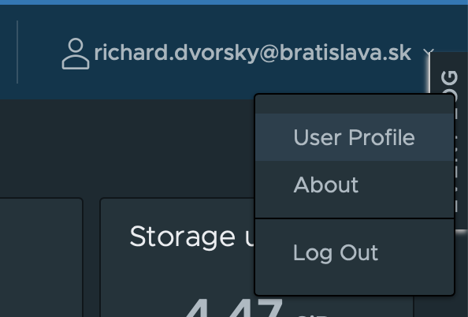

```bash
 ____                   _     _         _                             _   _
| __ )   _ __    __ _  | |_  (_)  ___  | | __   __ _            ___  | | (_)
|  _ \  | '__|  / _` | | __| | | / __| | |/ /  / _` |  _____   / __| | | | |
| |_) | | |    | (_| | | |_  | | \__ \ |   <  | (_| | |_____| | (__  | | | |
|____/  |_|     \__,_|  \__| |_| |___/ |_|\_\  \__,_|          \___| |_| |_|
```

### Simple deployment utility for our Bratislava projects

## Installation

Installing dependencies

```bash
yarn global add bratislava/bratiska-cli
```

#### Note

This utility needs `linux` based operating system to run properly. If you are using `Windows`, you can use `WSL` to run
it.

### Versions

We provide three versions of `bratiska-cli`:

- `stable` - this is the stable version of `bratiska-cli` which is sometimes more versions behind than `beta`. And it is
  used in our CI/CD pipelines.
- `beta` - this is the latest version of `bratiska-cli` which is not always stable
- `vX.X.X` - this is the specific version of `bratiska-cli` which is not always stable, but it usually the latest.

To install specific version of `bratiska-cli` use:

```bash
yarn global add bratislava/bratiska-cli#vX.X.X
```

To install `beta` version of `bratiska-cli` use:

```bash
yarn global add bratislava/bratiska-cli#beta
```

To install `stable` version of `bratiska-cli` use:

```bash
yarn global add bratislava/bratiska-cli#stable
```

## Prerequisites

To be able to work with this utility, you need to have a few things configured. Different commands require different
accesses.
How to install required tools and how to configure them is described bellow this list. This utility runs only on `linux`
based operating systems.

### `tag` command

Is the simplies command, it requires only:

- installed `git`
- correct access rights to github repository.

### `build_image` command

Requires more things to be installed and configured:

- installed `git`
- installed `docker`
- access rights to docker repository
- access rights to github repository

### `build_kustomize` command

Requires even more things to be installed and configured:

- installed `git`
- installed `docker`
- installed `kustomize`
- installed `envsubst`
- access rights to docker repository
- access rights to github repository

### `deploy` command

The most complex command, requires much more things to be installed and configured:

- installed `git`
- installed `docker`
- installed `kustomize`
- installed `envsubst`
- installed `kubectl`
- access rights to docker repository
- access rights to github repository
- access rights to kubernetes cluster

#### Accesses:

1. Docker Harbor access - can be
   granted [here](https://portal.azure.com/#view/Microsoft_AAD_IAM/ManagedAppMenuBlade/~/Users/objectId/7b1ee611-cf01-4179-a765-215ee291f687/appId/216af6db-a39f-44b3-94d1-fd5142f14e6a) (
   note
    - [OIADS_EMPLOYEES](https://portal.azure.com/#view/Microsoft_AAD_IAM/GroupDetailsMenuBlade/~/Members/groupId/48fcf79f-46c5-44fc-8608-70eb512f840c)
      are included by default)
2. Kubernetes access - contact the IT department
3. Github access on github.com/bratislava - contact the IT department

#### Install guides

1. Installed `git` (https://git-scm.com/book/en/v2/Getting-Started-Installing-Git)
2. Installed `kubectl` (https://kubernetes.io/docs/tasks/tools/)
3. Installed `Bratislava kubectl vsphere plugin`, you need to be connected on cable or through VPN to magistrat (https://k8s.tanzu.bratislava.sk/)
  - Windows - copy `kubectl` and `kubectl-vsphere` to `c:/windows/system32` (needed admin rights) otherwise `kubectl vsphere login` commands will not work
4. Installed `kustomize` (https://kubectl.docs.kubernetes.io/installation/kustomize/)
5. Installed `docker` (https://docs.docker.com/engine/install)
6. Installed `envsubst` (`brew install gettext`)
7. Kustomization files in `/kubernetes` folder

#### Required running apps:

These apps needs are running when you use `bratiska-cli`:

- running `docker`
- You must be signed in to our docker repository `harbor.bratislava.sk`. See the manual below.

    ```bash
    docker login https://harbor.bratislava.sk
    ```
  For Windows WSL use:
    ```bash
    docker login harbor.bratislava.sk
    ```
- You need to have running `kubect` and be signed into the Kubernetes cluster. If you have issues signing to Kubernetes,
  contact your administrator.

## Usage

### command `tag`

This is the simpliest command of `bratiska-cli`. We are using it for our CI/CD. It is creates a tag on the current
branch and pushes it to the remote repository. Before creating the tag, it checks if the current branch is clean and if
there are any untracked files, and it is pulling the newest version from the repository. Then it tries to dtermine the
branch, enviroment or user to create proper tag value for some enviroments (see bellow tag values).

#### Add tag

To tag a version of a code you can simply run just this command. Please note that this command will create a tag locally
and on remote repository.
This creates a dynamic tag based on your current environment (checking it from kubernetes if authorized). See tags
format bellow.

```bash
bratiska-cli tag
```

##### Specify environment

You don't have to use automatic environment, there is also option to specify `env` in command:

```bash
bratiska-cli tag dev
```

Allowed `env` values are `dev`, `staging`, `prod`.

##### Specify environment and tech

Maybe you would like to invoke only deployment of `strapi` or `next` so use this command:

```bash
bratiska-cli tag staging-strapi
```

or

```bash
bratiska-cli tag staging-next
```

##### Specify environment, tech and version

Automatically to every tag we increment last value. So if a tag is on `staging-strapi1.2.2` it will be automatically
incremented to `staging-strapi1.2.3`.

```bash
bratiska-cli tag staging-strapi
```

If you did some feature update, use feature flag `--feature` to increment feature version from `staging-strapi1.2.2`
to `staging-strapi1.3.0`

```bash
bratiska-cli tag staging-strapi --feature
```

And if you did major change, you can use `--major` flag to increment from `staging-strapi1.2.2` to `staging-strapi2.0.0`

```bash
bratiska-cli tag staging-strapi --major
```

or you can specify tech by using `--tech` flag:

```bash
bratiska-cli tag staging --tech strapi
```

##### Specify tag value

Sometimes you need different tag value, so use `--tag` flag to define your custom tag:

```bash
bratiska-cli tag --tag stable
```

or just specify version:

```bash
bratiska-cli tag --tag v1.2.3
```

##### Tag local only

To tag only locally use `--local` flag:

```bash
bratiska-cli tag --local
```

##### Tag local only without pulling changes from the remote repository

To tag only locally use `--local --no_pull` flag:

```bash
bratiska-cli tag --local --no_pull
```

#### Delete tag value

If you need to delete tag, you can use automatic last tag delete by tech, or you can specify it. Just add `--delete`
flag.

```bash
bratiska-cli tag --tag stable --delete
```

(deletes `stable` tag)

```bash
bratiska-cli tag dev-next --delete
```

(deletes last `dev-next` tag)

#### Recreate tag value

If tag is already created on different commit, you can recreate it on your current commit like:

```bash
bratiska-cli tag --tag stable --recreate
```

(delete old `stable` and create it in a current commit)

#### Debugging

If you have some problem, there is always option to use --debug flag to print more info.

```bash
bratiska-cli tag --tag stable --recreate --debug
```

or use `--dry_run` flag to see what will be done:

```bash
bratiska-cli tag --tag stable --recreate --dry_run
```

#### Tags format

For every environment we have different tag format:

##### Environment `dev`

Tags are based on format `{env}-{tech}-{branch}-{commit_short}-{user_name}` so it can be
like: `dev-next-master-4a18e16-richi`

##### Environment `staging` and `prod`

Tags are based on format `{env}-{tech}{version}` so it can be like `staging-next1.4.7`

#### Versions format

Versions are done in a way:

- bugfix is incrementing last digit `0.0.1`
- feature is incrementing middle digit `0.1.0`
- major is incrementing first digit `1.0.0`

### command `build_image`

For building images we are using command `build_image`. It is building image from Dockerfile in the current directory
and pushing it to our docker repository.

#### Build image

The simplest usage is using command without any flags. It will build image from Dockerfile in the current directory and
push it to our docker repository.

```bash
bratiska-cli build_image
```

#### Don't push image to the registry

If you don't want to push image to the registry, use `--build_image_no_registry` flag.

```bash
bratiska-cli build_image --no_push
```

#### Specify image registry

If you want to specify image registry, use `--registry` flag.

```bash
bratiska-cli build_image --registry harbor.example.com
```

#### Specify namespace

If you want to specify for harbor, use `--namespace` flag.

```bash
bratiska-cli build_image --namespace wordpress
```

#### No image registry check

CLI will tell you that image you are building is already in registry. To skip this check use `--no_image_repo_check`
flag.

```bash
bratiska-cli build_image --no_image_repo_check
```

#### Define build time sentry

If you want to define build time sentry token, use `--sentry` flag.

```bash
bratiska-cli build_image --sentry 1234567890
```

#### Force rebuild an image

If you want to force rebuild an image, use `--force_rebuild` flag. It is needed for overriding cache and image tag.

```bash
bratiska-cli build_image --force_rebuild
```

##### Specify the tag value

If you want to specify tag for the image, use `--tag` flag.

```bash
bratiska-cli build_image --tag 6.2-wordpress-php-fpm8.2
```

#### Debugging

If you have some problem, there is always option to use --debug flag to print more info.

```bash
bratiska-cli build_image --force_rebuild --debug
```

To use beta functionality, you can use `--beta` flag.

```bash
bratiska-cli build_image --force_rebuild --beta
```


### command `build_kustomize`

If you want to just build kustomize from the source `/kubernetes` folder you can use `build_kustomize` command.

#### Build kustomize

This commands build kustomize from the source `/kubernetes` folder. Please note that you need have already ready image
in the registry.

```bash
bratiska-cli build_kustomize
```

#### Specify image environment

If you want to specify image environment, use:

```bash
bratiska-cli build_kustomize dev
```

allowed values are `dev`, `staging` and `prod`

#### Build image with custom image

If you want to build image with custom image, use `--image` flag. Please note that you need have already ready image in
the registry.

```bash
bratiska-cli build_kustomize --image harbor.example.com/standalone/nest-prisma-template/master-4a18e16-richi
```

if you want to just use whatever image, then after `--image` flag type app package name, like `nest-prisma-template`

```bash
bratiska-cli build_kustomize --image app-package-name
```

#### No image registry check

CLI will tell you that image you are building is already in registry. To skip this check use `--no_image_repo_check`
flag.

```bash
bratiska-cli build_kustomize --no_image_repo_check
```

#### Specify namespace

If you want to specify kubernetes namespace together with harbor namespace (we use it together), use `--namespace` flag.

```bash
bratiska-cli build_kustomize --namespace standalone
```

#### Specify deployment name

If you want to specify kubernetes deployment name, use `--deployment` flag.

```bash
bratiska-cli build_kustomize --deployment nest-prisma-template
```

#### Specify kustomize path

If you want to specify kustomize address path, use `--kustomize` flag.

```bash
bratiska-cli build_kustomize --kustomize /new_kubernetes
```

#### Define host address

If you want to define host address, use `--host` flag.

```bash
bratiska-cli build_kustomize --host nest-prisma-template.example.com
```

#### Debugging

If you have some problem, there is always option to use --debug flag to print more info.

```bash
bratiska-cli build_kustomize --debug
```

To use beta functionality, you can use `--beta` flag.

```bash
bratiska-cli build_kustomize --beta
```

### command `deploy`

Before you run any of the following commands, make sure you are

1. logged in to harbor (see [running apps](#running-apps) above, as well as the [signing to harbor](#signing-to-harbor)
   section below)
2. logged in to correct cluster (replace `<env>` is one of `dev`, `staging` or `prod` and `user.name@bratislava.sk` with
   your credentials)

- to login through Windows you need to set password `export KUBECTL_VSPHERE_PASSWORD={{password}}`

```
kubectl vsphere login --server=10.10.10.1 --insecure-skip-tls-verify --tanzu-kubernetes-cluster-name=tkg-innov-<env> -u user.name@bratislava.sk
```

3. if you are logged in to multiple clusters, make sure you are using the correct
   one - `kubectl config use-context tkg-innov-<env>`

#### Simple deploy

There is straightforward usage because the utility tries to obtain all values from the repo automatically, and if
something is missing, it will point out.

```bash
bratiska-cli deploy
```

#### Specify deploy environment

if you want to specify image environment, use:

```bash
bratiska-cli deploy dev
```

allowed values are `dev`, `staging` and `prod`.

#### Also you can specify all options manually

```bash
If you need to deploy to staging or production, you need to add a special flag to the command.

```bash
bratiska-cli deploy --staging
```

or

```bash
bratiska-cli deploy --production
```

#### Deploy with a special image

If you have a specified image, you can deploy it.

```bash
bratiska-cli deploy --image harbor.bratislava.sk/standalone/nest-prisma-template:bratiska-cli-3f3ce4fd14c76138a081596b2987a81f18a3c747-master-untracked
```

#### Specify kustomize file or folder

If you want, you can specify the kustomize file or kustomize folder with this command:

```bash
bratiska-cli deploy --kustomize ./path/path
```

#### Dry run, without deploying to Kubernetes

If you don`t want to deploy to Kubernetes, then you can run it with a dry run flag:

```bash
bratiska-cli deploy --dry_run
```

#### Namespace

The default namespace for utility is `standalone`, but you can change it to other like:

```bash
bratiska-cli deploy --namespace=bratislava-monorepo
```

#### Deployment

Default deployment for the app names from `project.json`, but you can change it like:

```bash
bratiska-cli deploy --deployment=nest-prisma-template-super-duper
```

#### Host

Default deployment host for an app depends on `deployment` and `environment`, but you can change it like:

```bash
bratiska-cli deploy --host=starwars.bratislava.sk
```

Or you switch env with `kubectl config use-context tkg-innov-dev`

#### Registry

If you want to use a different registry like `ghcr.io`, you can change it here, but don`t forget to add new credentials.

```bash
bratiska-cli deploy --registry=ghcr.io
```

#### Staging and Production

To deploy to the stage, you need to add `--staging` flag, and your changes need to be committed and pushed to branch to
our repository. You can`t have untracked changes.

The same applies to production, so you must use `--production`, and changes must be merged to master. Otherwise, you
can`t update production.

```bash
bratiska-cli deploy --staging
```

#### Debug

If you need to debug the deploy process, you can add the `--debug` option. This will save the kustomize manifest to the
directory so you can inspect it. Also, it does not delete the image from docker, so you can look at it.

```bash
bratiska-cli deploy --debug
```

### Examples

Dry run with custom image and specified folder to kustomize.

```bash
bratiska-cli deploy --dry_run --image harbor.bratislava.sk/standalone/nest-prisma-template:bratiska-cli-3f3ce4fd14c76138a081596b2987a81f18a3c747-master-untracked --kustomize ./kubernetes/base
```

## Automatisation

### Bratiska-cli args in config.json

You can automatize the running of the utility with a configuration file, which can overwrite startup arguments. If you
need to have some permanent settings on the environment, you can define a config
in `/kubernetes/envs/[Dev,Staging,Prod]` with the name `config.json`. Config is overriding all options passed or
automatically assessed by the bratiska-cli utility. Example of config:

Example of `config.json` file

```json
{
  "host": "bratislava.sk",
  "env": "prod"
}
```

### Environment variables for kustomize

You can extend `config.json` with custom environment variables for kustomize attributes. For example, you can define
some
settings in kustomize, which needs to be dynamic like:

```yml
apiVersion: apps/v1
kind: Deployment
metadata:
  name: ${BUILD_REPOSITORY_NAME}-app
  namespace: ${NAMESPACE}
  labels:
    service: app
```

So `${BUILD_REPOSITORY_NAME}` is env variable `BUILD_REPOSITORY_NAME` which you can define in `config.json` like here:

```json
{
  "host": "gmb.sk",
  "envs": {
    "BUILD_REPOSITORY_NAME": "super-duper-app"
  }
}
```

Btw `BUILD_REPOSITORY_NAME` is automatically created from `package.json`, so there is no need to create it
in `config.json`

### Environment variables for docker next build

Sometimes you need to have different environment variables for other clusters during docker next build with bratiska.
You can
achieve it by creating files:

`.env.bratiska-cli-build.dev`
`.env.bratiska-cli-build.staging`
`.env.bratiska-cli-build.prod`

Which is then loaded by bratiska-cli, and all its content is copied to file `.env.production.local`, which is then
loaded to docker and processed by next during the build. More info regarding the next envs can be found
here: https://nextjs.org/docs/basic-features/environment-variables

### Environment variables passed to kustomize files

```dotenv
BUILD_REPOSITORY_URI
```

Git repository uri, and if is an external image, then the value is `using_external_image`

```dotenv
BUILD_REPOSITORY_NAME
```

name from package.json

```dotenv
DEPLOYMENT_ENV
```

it is used in URL addresses like `DEPLOYMENT_ENVbratislava.sk`
dev => `dev.`
staging => `staging.`
prod => `` (is empty)

```dotenv
ENV
```

Can have three values: `dev`, `staging`, `prod`

```dotenv
HOSTNAME
```

or

```dotenv
BRATISKA_HOSTNAME
```

the hostname of the app

```dotenv
IMAGE_TAG
```

complete image tag with URL and tag
like `harbor.bratislava.sk/municipal-police/zandaris:bratiska-cli-1.5.64-pipelines-1e6277615d3649300384a399f7cb6a8c12a0e128-master-v0.3.1`

```dotenv
IMAGE
```

image part of `IMAGE_TAG` like `harbor.bratislava.sk/municipal-police/zandaris`

```dotenv
TAG
```

tag value `bratiska-cli-1.5.64-pipelines-1e6277615d3649300384a399f7cb6a8c12a0e128-master-v0.3.1`

```dotenv
GIT_TAG
```

value of git tag used in a deployment like `dev1.47.`

```dotenv
COMMIT
```

value of commit `1e6277615d3649300384a399f7cb6a8c12a0e128` and if we are using external image then value
is `using_external_image`

```dotenv
NAMESPACE
```

Namespace where should be image deployed like `standalone`

```dotenv
IMAGE_PULL_SECRET
```

an Image pull secret name, which is then checked if it exists on Kubernetes
like `harbor-secret-dev-standalone-bratiska-cli`

```dotenv
INTERNAL_APP_PORT
````

App port which is then exposed to the public like `1338`

## More manuals

### Signing to harbor

We need to configure a harbor connection for uploading images to the registry.

1. Open our registry website: https://harbor.bratislava.sk
2. Sign in with your Azure account
3. Copy CLI secret from your profile. Follow the picture guide:

    - Go to your profile in the right top corner:

      

    - Click on `User Profile
    - Copy `CLI secret`
      

4. Sign in docker with the command:

```bash
docker login https://harbor.bratislava.sk
```

You use your username `your.name@bratislava.sk` and `CLI secret` value 5. When you see `Login Succeeded,` then you are
done 👏

## Development

You need to pull this repo with
`git clone bratislava/bratiska-cli`. Then you can build it with the command: `yarn run build`. You could test it locally
with `yarn run start` if everything were built fine.


## Release

Create tag:
```bash
git tag -a v1.3.5 -m "1.3.5 env fix" 
```

Push tag
```bash
git push origin v1.3.5
```

## Stay in touch

- If you find some bug, please get in touch with us on GitHub or mail inovacie@bratislava.sk
- Website - [https://inovacie.bratislava.sk/](https://inovacie.bratislava.sk/)

